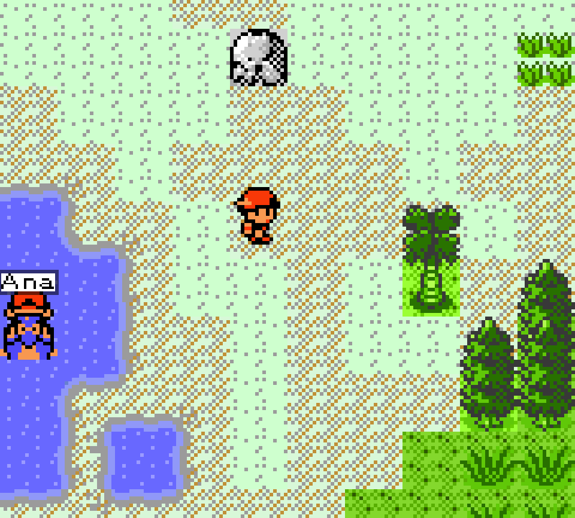
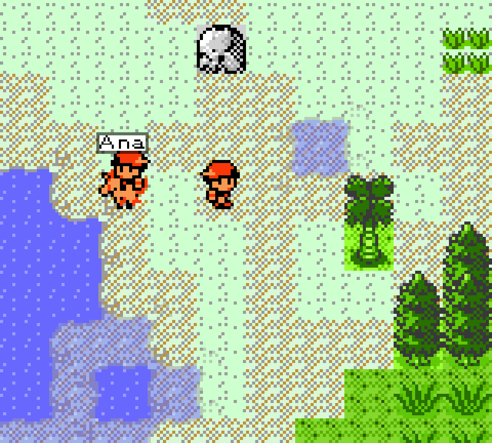
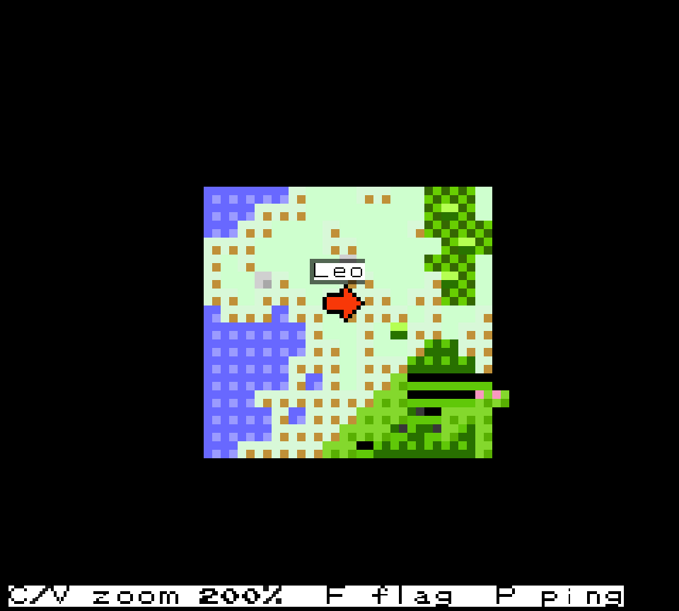

# PokeWilds Coop

An unofficial online cooperative mod for [PokemonWilds](https://github.com/SheerSt/pokewilds) 0.8.11.

Multiplayer was planned for PokeWilds 0.9 but that version never came out, and my friends and I wanted to play together anyway. So i made this mod. You can host a game from the main menu and your friends join you, or you can run a dedicated server that stays online on its own..

It's still a dev build, so there will be bugs. Any bug report or idea for improvement will be appreciated.

## How to Download

- **Mod (everyone needs this):** [PokeWilds-Coop-Mod.zip](https://github.com/Magen-pr/pokewilds-coop/releases/latest/download/PokeWilds-Coop-Mod.zip)

- **Dedicated server (optional):** [PokeWilds-Coop-Server.zip](https://github.com/Magen-pr/pokewilds-coop/releases/latest/download/PokeWilds-Coop-Server.zip)

 ## Virustotal scan
 PokeWilds-Coop-Mod.zip:
 https://www.virustotal.com/gui/file/e71bd1e04fe3d86398431bd8530d767b1753fbf48481a1eed2b4b761a97c0197?nocache=1
 SHA-256: e71bd1e04fe3d86398431bd8530d767b1753fbf48481a1eed2b4b761a97c0197

 PokeWilds-Coop-Server.zip:
 https://www.virustotal.com/gui/file/76979e2ad7b7da08417f1e3daec47d88af7a43a5fe11f713eca344fe40abefd7?nocache=1
 SHA-256: 76979e2ad7b7da08417f1e3daec47d88af7a43a5fe11f713eca344fe40abefd7 

 

You also need the official game. You can find it in https://github.com/SheerSt/pokewilds/releases.
The mod only works on the version 0.8.11.

## How to Install (Windows)

1. Download the official PokeWilds for Windows and unzip it.
2. Extract the mod zip and copy the "app" folder into the main game folder. Say yes when Windows asks to replace files.
3. Start the game. If the first line of the main menu says `LOCAL HOST JOIN`, it worked.

Everyone who plays needs the mod :).
For Linux and Mac read instructions in `OTHER-SYSTEMS_EN.txt` inside the zip. The full guide is `README_EN.txt` (and `LEEME_ES.txt` if you speak Spanish).

## How to play

- **HOST:** one of you picks HOST, creates or loads a world and plays normally. The others pick JOIN and type the host's IP.
- **Dedicated server:** unzip the server, edit `server.cfg` if you want and run `start.bat` (or `start.sh`). Java 8 or newer is needed. The first time you enter into the world, the world will generate.

## Features

- Shared world with your friends.
- You can play solo or together.
- Trade pokemon between players interacting.
- Chests are shared. You have a new chest, "Private chest" only for own stuff.
- Legendary and special Pokemon combat is a raid with Shared HP (Feature in alpha)
- Raikou, Entei and Suicune event
- Night hordes event
- Map with info of all players.
- New settings feature: Control volume and more new parameters.
- Battle speed up to x4 (Left Alt in battle, can be configured)
- Admin commands for the server: kits, tp, spawn, events, day/night length and more

## New hotkeys

| Key | What it does |
|---|---|
| M | Map (C/V to zoom) |
| F | Field move available in your team |
| T | Open command line |
| TAB | Player list |
| P | Ping the tile in front of you |
| Left Alt | Increase battle speed (in battle) |
| F10 | Save a bug report txt |

## Bug reports

Press F10 in game. It saves a .txt in the `bugreports` folder next to the game. Open an issue here with that file and tell me what you were doing when it broke. The report doesn't include sensible information.

## Credits

PokeWilds is made by SheerSt. This is a fan mod, it's not official and it's not affiliated with SheerSt, Nintendo, Game Freak or The Pokemon Company. Pokemon is a trademark of its owners. The mod is free and always will be.
